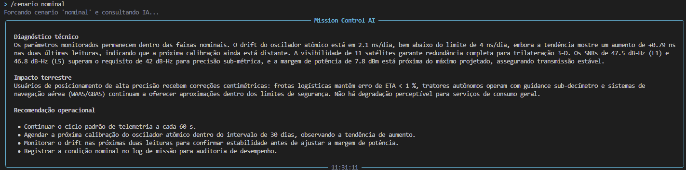
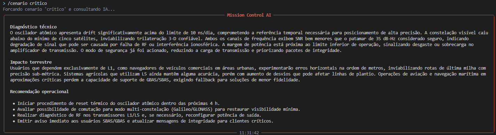

# 🛰️ Mission Control AI — Trilha MobilitySat

Sistema de monitoramento operacional de satélite GNSS (Global Navigation Satellite System) que integra **telemetria simulada**, **lógica de decisão em Python** e **IA generativa via Ollama Cloud** para traduzir o estado técnico do satélite em impacto terrestre para frotas logísticas e agricultura de precisão no Brasil.

> Global Solution 2026.1 · FIAP Ciência da Computação
> Disciplina: **Prompt Engineering and Artificial Intelligence** · Prof. Jorge Luiz Gomes

---

## 👥 Integrantes

| Nome completo | RM | Turma |
|---|---|---|
| João Pedro do Vale Quagliano | 570233 | 1CCPH |
| Matheus Levi Dagel | 571961 | 1CCPH |

**Modalidade:** Dupla

---

## 🎯 O que o projeto faz

A Mission Control AI simula o monitoramento contínuo de um satélite GNSS em órbita média (MEO, ~20.000 km), similar a satélites das constelações GPS Block IIIA, Galileo FOC ou GLONASS-K. A cada ciclo, o sistema:

1. **Coleta telemetria** de cinco parâmetros operacionais do satélite (drift do oscilador atômico, satélites visíveis, SNR dos canais L1 e L5, margem de potência);
2. **Avalia em Python puro** se algum parâmetro saiu da faixa nominal, classificando severidade em NORMAL / ATENÇÃO / CRÍTICO;
3. **Executa respostas automatizadas** quando detecta falhas críticas (por exemplo, ativa Modo de Segurança ou migra tráfego do canal L1 para L5);
4. **Consulta a IA generativa** (modelo `gpt-oss:120b` via Ollama Cloud) para gerar uma análise contextualizada em três seções: diagnóstico técnico, impacto terrestre e recomendação operacional.

A IA recebe **toda a telemetria injetada dinamicamente no prompt** e responde como um Engenheiro de Segmento Espacial sênior, conectando cada parâmetro técnico ao impacto concreto que ele tem na vida de frotas logísticas, produtores rurais que usam agricultura de precisão e operações aeronáuticas dependentes de SBAS/GBAS.

---

## 🧭 Trilha escolhida: MobilitySat

A trilha **MobilitySat** monitora um satélite de navegação GNSS — o tipo de satélite que está por trás de praticamente toda operação de mobilidade moderna no Brasil:

- 🚛 **Logística rodoviária** — rastreamento de frotas de caminhões e entregas;
- 🚜 **Agricultura de precisão** — piloto automático em tratores, plantio em taxa variável;
- ✈️ **Aviação comercial** — aproximação por SBAS/GBAS em aeroportos regionais;
- 🚢 **Navegação marítima** — manobra em canais restritos e cabotagem.

Quando um satélite GNSS opera bem, **ninguém percebe**. Quando opera mal, todos esses setores sofrem em tempo real — e a maioria das operações não tem capacidade técnica para identificar a causa raiz. O Mission Control AI demonstra esse ciclo de propagação técnica-para-negócio.

---

## 👤 Persona atendida

O sistema foi desenhado para o **Engenheiro de Segmento Espacial em plantão** no centro de operações da constelação. Em situações reais, esse profissional precisa interpretar telemetria sob pressão de tempo (minutos para tomar decisão) e comunicar o impacto para gestores que **não dominam física de relógios atômicos ou frequência L1/L5** mas precisam decidir se acionam protocolos de contingência.

A IA atua como copiloto desse engenheiro: traduz a leitura técnica em uma narrativa estruturada em três partes (diagnóstico, impacto, recomendação), permitindo que o profissional **comunique imediatamente** com a gestão operacional terrestre.

---

## 🛠️ Tecnologias utilizadas

| Componente | Versão | Função |
|---|---|---|
| Python | 3.10+ | Linguagem base |
| Ollama Cloud API | — | Acesso ao modelo de linguagem `gpt-oss:120b` |
| `ollama` | 0.6.2 | Cliente Python oficial da Ollama Cloud |
| `python-dotenv` | 1.2.2 | Carrega credenciais do arquivo `.env` |
| `rich` | 15.0.0 | Painéis, tabelas e cores no terminal |
| `prompt-toolkit` | 3.0.52 | Input editável estilo Claude Code |
| `pyfiglet` | 1.0.4 | Banner ASCII art da abertura |

---

## ▶️ Como executar

### 1. Pré-requisitos

- Python 3.10 ou superior instalado
- Conta gratuita no [Ollama Cloud](https://ollama.com) com uma API key gerada

### 2. Clonar o repositório

```bash
git clone https://github.com/<seu-usuario>/mission-control-ai.git
cd mission-control-ai
```

### 3. Criar ambiente virtual e instalar dependências

**Windows (PowerShell):**
```powershell
python -m venv .venv
.venv\Scripts\Activate.ps1
pip install -r requirements.txt
```

**Linux / macOS:**
```bash
python -m venv .venv
source .venv/bin/activate
pip install -r requirements.txt
```

### 4. Configurar a API key

Copie o arquivo de exemplo e preencha com sua chave da Ollama Cloud:

```bash
cp .env.example .env
# edite o .env com seu editor preferido e cole a chave
```

O arquivo `.env` deve ficar assim:

```
OLLAMA_API_KEY=sua_chave_real_aqui_sem_aspas
```

> ⚠️ **Nunca commite o arquivo `.env`** — ele está no `.gitignore` por padrão. A chave da Ollama é credencial pessoal.

### 5. Executar

```bash
python main.py
```

O banner ASCII deve aparecer, seguido do painel de boas-vindas com o status do engine. O prompt `>` ficará aguardando input.

---

## 🎮 Comandos da CLI

| Comando | Função |
|---|---|
| `/help` | Lista todos os comandos disponíveis |
| `/status` | Snapshot da telemetria atual **sem chamar a IA** (instantâneo) |
| `/cenario nominal` | Força cenário de operação nominal e pede análise da IA |
| `/cenario atencao` | Força cenário de atenção e pede análise da IA |
| `/cenario critico` | Força cenário crítico e pede análise da IA |
| `/about` | Sobre o projeto e a equipe |
| `/clear` | Limpa a tela e reexibe o banner |
| `/exit` | Encerra o sistema |
| *qualquer outra pergunta* | Coleta telemetria nova e pede análise contextualizada |

### Exemplo de uso

```
> Como está a missão?
[a IA responde com diagnóstico + impacto terrestre + recomendação]

> /cenario critico
[força cenário crítico, ativa modo de segurança automaticamente,
 e a IA explica o que aconteceu e o que fazer]

> O drift atômico está crescendo, isso é grave?
[IA responde no contexto da telemetria recém-coletada]
```

---

## 📸 Demonstração

> Os prints abaixo foram capturados rodando o sistema localmente após configuração completa do `.env`.

### Painel inicial e operação nominal


### Cenário crítico com IA explicando o estado


---

## 🧠 System prompt

O system prompt completo está em [`prompts/system_prompt.md`](prompts/system_prompt.md). Os pontos-chave da engenharia do prompt:

- **Persona definida** — Engenheiro de Segmento Espacial sênior, tom técnico-acessível;
- **Escopo restrito** — recusa perguntas fora do contexto da missão GNSS;
- **Restrições anti-alucinação** — proibido inventar valores, proibido decidir severidade (isso é do código Python);
- **Formato fixo de saída** — três seções: Diagnóstico técnico → Impacto terrestre → Recomendação operacional;
- **Few-shot prompting** — três exemplos calibradores (operação nominal, atenção, crítico com ação automatizada);
- **Conexão terrestre obrigatória** — toda resposta deve articular quem na Terra está sendo afetado.

---

## 🔬 Cenários de teste demonstrados

1. **Operação nominal** (`/cenario nominal`) — Todos os parâmetros dentro da faixa segura. A IA confirma operação plena para frotas logísticas, tratores autônomos e SBAS.
2. **Drift atômico em janela de atenção** (`/cenario atencao`) — Relógio embarcado fora do ótimo, SNR L1 reduzido, potência baixa. Sistema mantém operação mas sugere agendar calibração nas próximas 72h.
3. **Falha múltipla crítica** (`/cenario critico`) — Drift acima do limite operacional, visibilidade abaixo do mínimo seguro, SNR crítico em L1 e L5. Sistema **automaticamente ativa Modo de Segurança** e a IA orienta protocolos de contingência (multi-constelação, transferência para satélite reserva).
4. **Memória de tendência** — Após várias leituras consecutivas, o engine identifica padrões (drift crescendo, visibilidade caindo) e alimenta esse contexto à IA, simulando consciência temporal.
5. **Pergunta fora de escopo** — A IA recusa cordialmente e redireciona para o contexto da missão.

---

## ⚠️ Limitações conhecidas

Para manter a honestidade técnica que este projeto preza, vale documentar o que o sistema **não faz**:

- **Não usa telemetria real** — todos os parâmetros são simulados com faixas físicas plausíveis, mas não correspondem a um satélite específico em órbita real.
- **Não persiste histórico em disco** — o histórico de tendência fica em memória e se perde ao encerrar a sessão. Seria trivial salvar em SQLite ou JSON, mas extrapola as 5 horas de esforço previstas.
- **Janela de tendência limitada às últimas 5 leituras** — suficiente para detectar drift acumulando, mas não capta padrões de longo prazo (degradação semanal, sazonalidade orbital).
- **Não simula a constelação inteira** — monitora apenas um satélite. Em operação real, o engenheiro acompanha 24+ satélites simultaneamente, com correlações entre eles.
- **A IA pode variar respostas** — mesmo com `temperature=0.3`, chamadas idênticas podem produzir nuances diferentes. Isso é característico de LLMs e foi mitigado por few-shot prompting, mas não eliminado.

---

## 💼 Proposta de valor / modelo de negócio

> Esta é a seção **Frente 6** da rubrica, que articula explicitamente o impacto terrestre da operação do satélite.

### 1. Qual o problema real terrestre que esta missão resolve?

GNSS é **infraestrutura crítica invisível** da economia brasileira. Quando um satélite degrada, os efeitos cascateiam imediatamente:

- **Logística rodoviária:** 70% das empresas de logística no Brasil já usam rastreamento por GPS (CNT, 2023). Em uma frota mediana de 100 veículos, uma redução de 15% no consumo de combustível via roteirização inteligente economiza cerca de **R$ 222 mil/ano** — economia que evapora quando o sinal degrada e o roteamento volta a ser estimativo.
- **Agricultura de precisão:** 46% dos produtores brasileiros entrevistados pela McKinsey (2024) usam piloto automático em tratores. Cerca de **9 milhões de hectares** no Brasil já operam sob agricultura de precisão (de 59 milhões totais). Quando o GNSS perde precisão centimétrica, plantio em taxa variável vira inviável — fertilizante é aplicado em excesso ou em falta.
- **Aviação regional:** aeroportos sem ILS (a maioria do interior brasileiro) dependem de SBAS para aproximação por instrumentos. Degradação do satélite força aviões a abortar pousos ou desviar para aeroportos alternativos, gerando custos operacionais e atrasos.

O sistema **antecipa essa cascata**: o engenheiro de plantão detecta a anomalia no satélite **antes** que os usuários terrestres percebam o efeito. A IA traduz o estado técnico em linguagem que a gestão entende, acelerando comunicação interna em centros de operação que historicamente sofrem com gargalo na ponte engenheiro→executivo.

### 2. Quem paga pela solução?

**Modelo híbrido**, com três fontes de receita complementares:

- **Operadora de satélite (B2B principal):** o cliente direto é a empresa proprietária da constelação (no Brasil, parceiros como Visiona, Akaer, ou futuras constelações nacionais públicas). Pagam licença anual de software para o centro de operações.
- **Setor público (concessão / contrato com agências):** a Agência Espacial Brasileira (AEB) e o ITA têm projetos de soberania espacial onde esse tipo de ferramenta é estratégico — contratos via dispensa de licitação ou pregão.
- **Grandes consumidores corporativos (SaaS premium):** cooperativas agrícolas como Coamo e C.Vale, e transportadoras como JSL e Patrus, têm interesse em receber **alertas antecipados de degradação do GNSS na sua região**. Subscrição mensal por veículo monitorado ou hectare coberto.

### 3. Métrica de impacto

Premissa: o satélite que este sistema monitora cobre uma área operacional que serve **120 mil veículos de frota** e **350 mil hectares de agricultura de precisão** no Brasil.

Se este satélite operar **100% saudável durante um ano**, com 0 minutos de downtime não-detectado:

- **Frotas logísticas:** economia agregada estimada em **R$ 26 milhões/ano** em combustível (15% sobre operação sem otimização);
- **Agricultura de precisão:** redução de **25% no uso de fertilizantes** sobre 350 mil hectares, economia de ~R$ 87 milhões em insumos e equivalente a **~2.500 toneladas de CO₂ evitadas** pelo menor uso de nitrogenados;
- **Aviação regional:** ~3 mil pousos por instrumentos viabilizados em aeroportos sem ILS no interior;
- **Tempo de diagnóstico de anomalias:** redução de média de **45 min para 5 min** (gargalo de comunicação interna no centro de operações).

### 4. Modelo de negócio

**Dado-como-serviço (DaaS) com camada de inteligência.** A operadora de satélite oferece o serviço de navegação como sempre fez (tradicional, baseado em uso de espectro), mas o Mission Control AI vira o **produto premium** que justifica retenção de clientes corporativos:

- **Camada base (incluída):** acesso ao sinal GNSS padrão;
- **Camada Mission Control (premium SaaS):** alertas antecipados, dashboard de impacto terrestre por cliente, integração com sistemas internos (ERP de frotas, plataformas de agricultura digital);
- **Camada de assinatura empresarial:** SLA de degradação avisado com 30 min de antecedência, multa contratual em caso de descumprimento.

O modelo se sustenta porque a **economia evitada** (R$ 26M+ na frota, R$ 87M na agricultura) supera em ordens de grandeza a mensalidade premium — o cliente paga porque a alternativa (não saber o que está acontecendo) é mais cara.

---

## 🎬 Vídeo de demonstração

🔗 https://youtu.be/UX6QUSSRa0w

> Configurado como "Não listado" no YouTube. Duração: até 3 minutos.
>
> O vídeo apresenta os integrantes, executa o sistema ao vivo, demonstra cenário nominal, cenário de atenção e cenário crítico com a IA respondendo em tempo real.

---

## 📂 Estrutura do projeto

```
mission-control-ai/
├── README.md                  # este arquivo
├── main.py                    # entrada do sistema
├── banner_ascii.py            # gerador standalone de banner ASCII
├── requirements.txt           # dependências fixadas
├── .env.example               # template das variáveis de ambiente
├── .gitignore                 # blinda .env e arquivos temporários
│
├── src/
│   ├── __init__.py
│   ├── ui.py                  # interface CLI estilo Claude Code
│   ├── engine.py              # motor de análise + função llm()
│   ├── telemetria.py          # geração simulada de telemetria GNSS
│   └── alertas.py             # thresholds e lógica de decisão Python
│
├── prompts/
│   └── system_prompt.md       # system prompt do gpt-oss:120b
│
├── data/                      # (reservado para cenários pré-definidos)
│
└── assets/
    ├── screenshot_normal.png  # print da operação nominal
    └── screenshot_alerta.png  # print do cenário crítico
```

---

## 📜 Licença

Projeto acadêmico — FIAP 2026. Uso livre para fins educacionais. Citação obrigatória dos integrantes em caso de reuso.
